# User interface gallery

The web application is responsive! Keep in mind only a few mobile user interfaces will be shown here, don't want to bore you with too many screenshots :)

Landing page

 
 

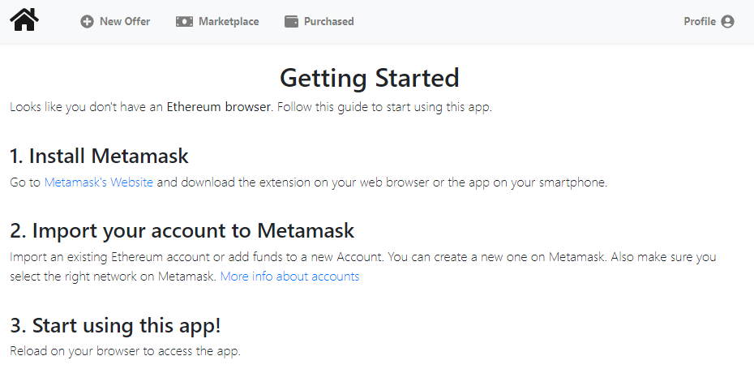

Aditional info screen for the user

 
 

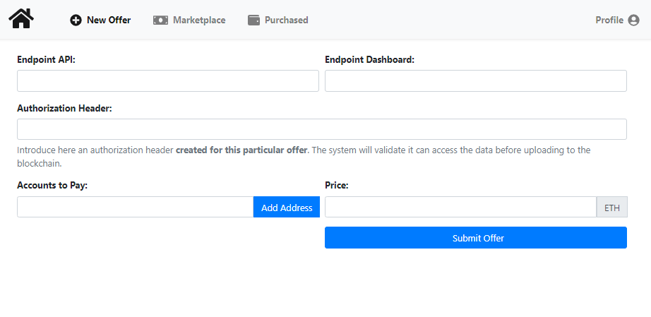

Register Offer form

 
 

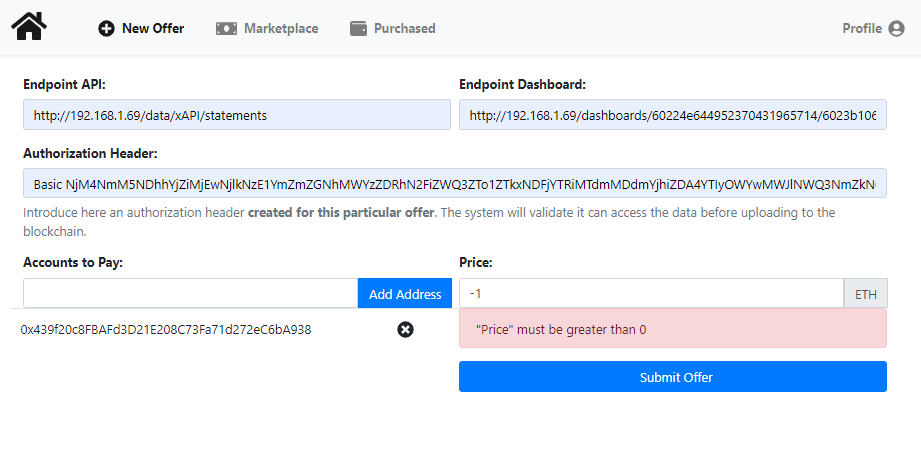

Form validation

 
 

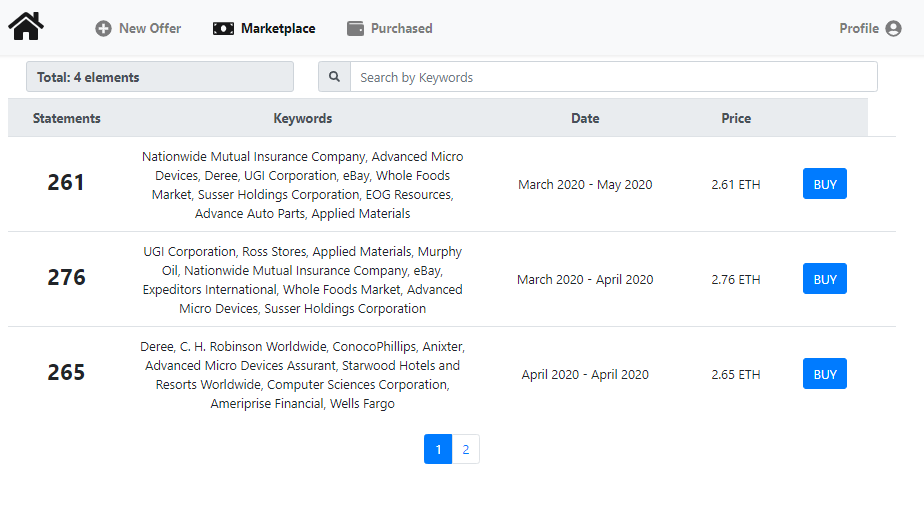

Available offers

 
 

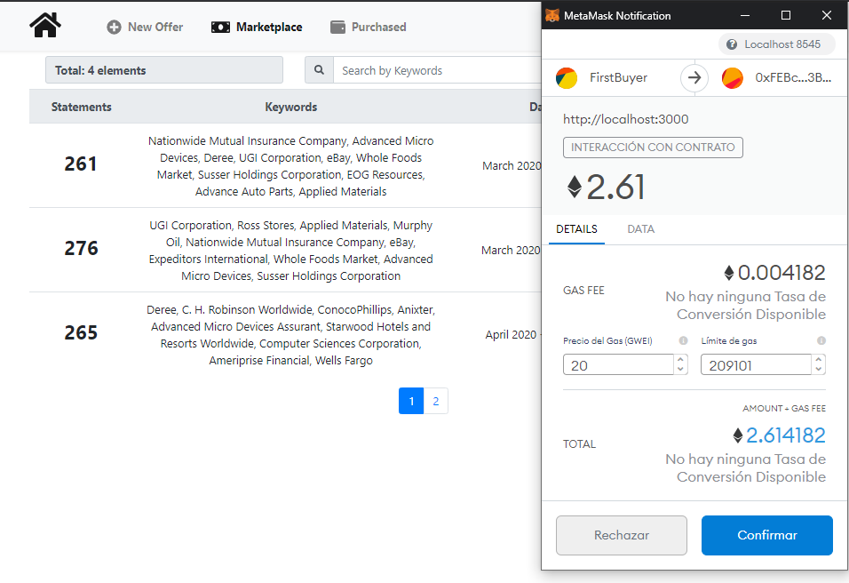

Confirm buy offer transaction

 
 

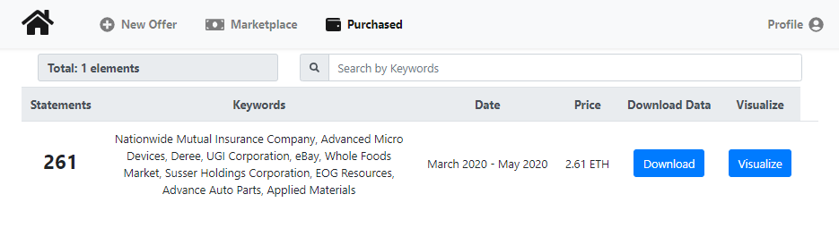

Purchased offers

 
 

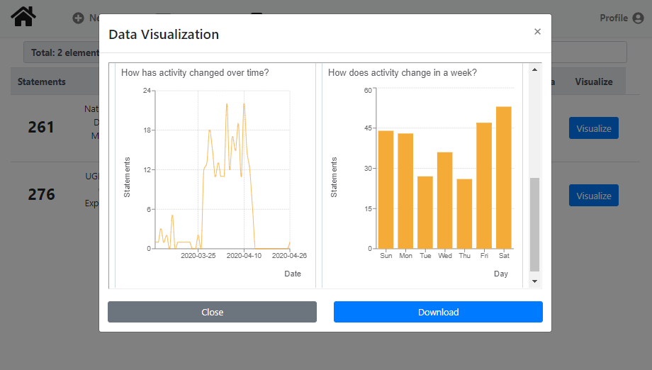

Visualize purchased offer stats

 
 

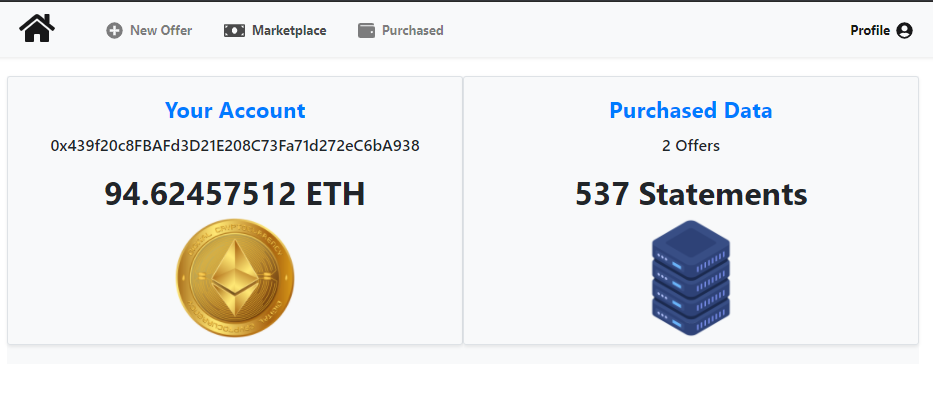

Account information

 
 

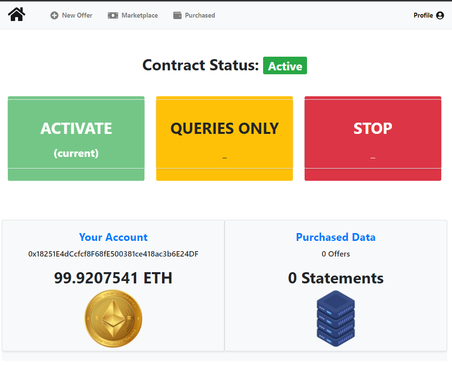

Owner functionality to alter the execution state of the Smart Contract

 
 

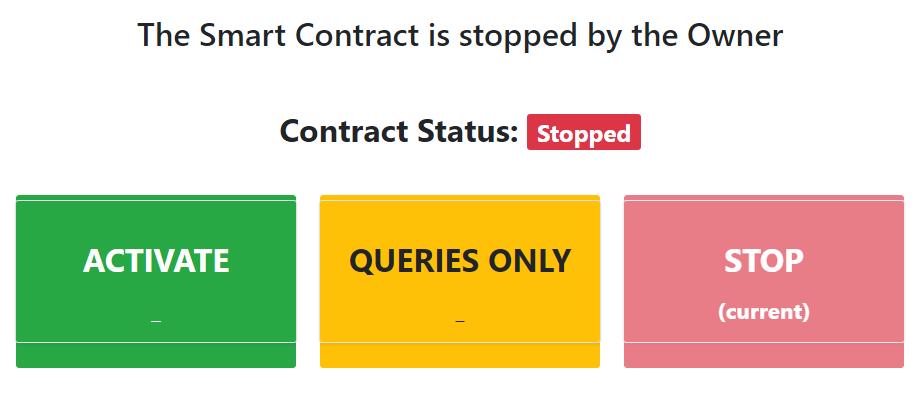

Owner interface with the contract Stopped

 
 

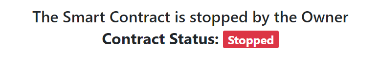

User interface with the contract Stopped

 
 

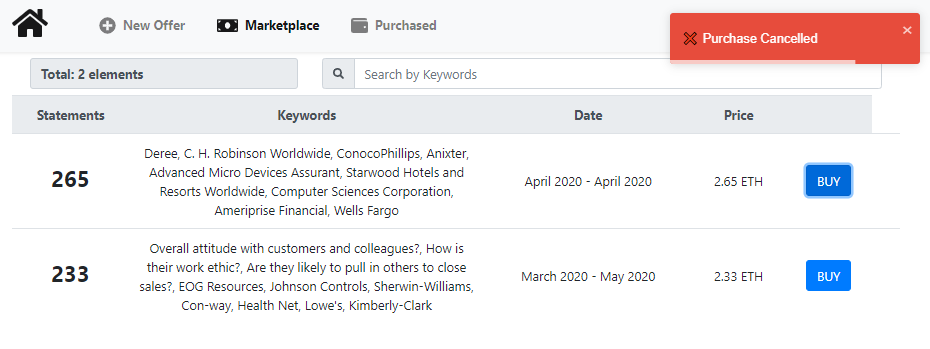

Float notification after reverted transaction

 
 

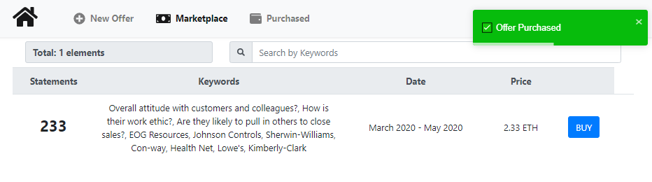

Float notification after successful transaction

 
 

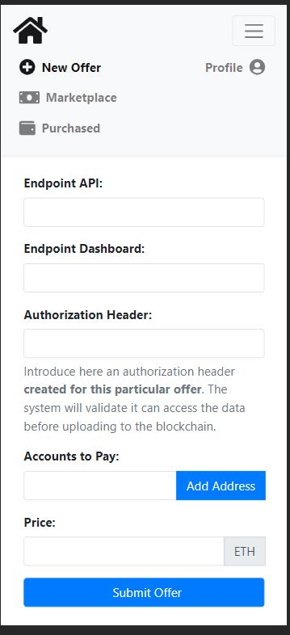

Example mobile interface 1

 
 

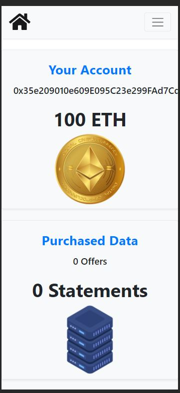

Example mobile interface 2

 
 

[Back to Readme](../Readme.md#smart-contract)
